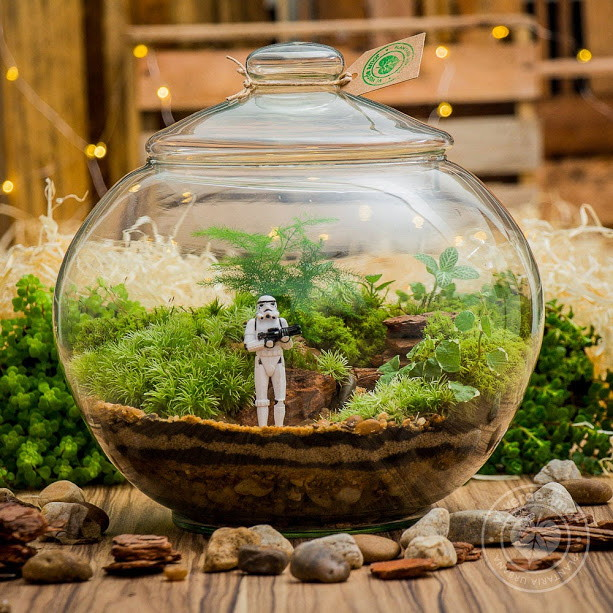

# Terrarium 2023-A

## Descripción 
Proyecto de la clase de programación web orientado a practicar las bases del código HTML + CSS + JS ❤

## Autor 

Hola

## 📝 Notas de clase 📝
1. HTML 
2. CSS
3. JavaScript

